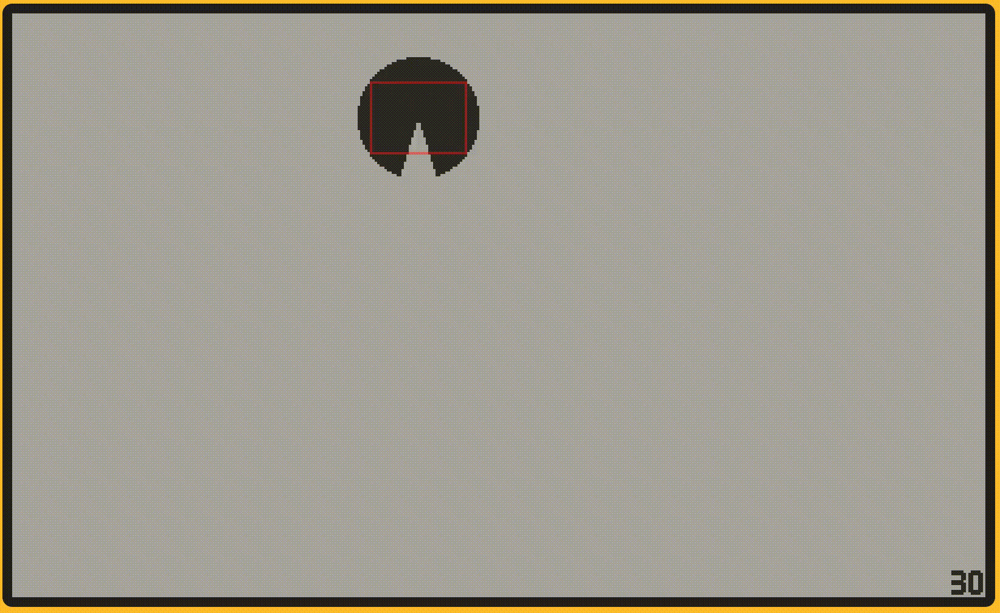

#  Playdate Demo - Pacman Debug Drawing

## Pacman demo in C: debugDraw rect for PlaydateSDK

## `debugDraw draw_rect`

The PlayDate Lua SDK includes a couple APIs for debug drawing
(colored overlay in the simulator only):

>[`playdate.setDebugDrawColor(r, g, b, a)`](https://sdk.play.date/inside-playdate/#f-setDebugDrawColor)
>
>   Sets the color of the playdate.debugDraw() overlay image.

> [`playdate.debugDraw()`](https://sdk.play.date/inside-playdate/#c-debugDraw)
>
>    Called immediately after playdate.update(), any drawing performed during this callback is overlaid on the display in 50% transparent red (or another color selected with playdate.setDebugDrawColor()).
>
>  White pixels are drawn in the debugDrawColor. Black pixels are transparent.

The C API also includes a version of this:

> [`LCDBitmap* playdate->graphics->getDebugBitmap(void)`](https://sdk.play.date/inside-playdate-with-c/#f-graphics.getDebugBitmap)
>
> Only valid in the Simulator, returns the debug framebuffer as a bitmap. Function is NULL on device.

Sadly, as of 2023-10-04, you cannot just take this LCDBitmap and pass it to

> [`void playdate->graphics->pushContext(LCDBitmap* target)`](https://sdk.play.date/inside-playdate-with-c/#f-graphics.pushContext)
>
> Push a new drawing context for drawing into the given bitmap. If target is nil, the drawing functions will use the display framebuffer.

[@laplab](https://github.com/laplab) figured out [how to bit-twidle
the underlying structure to set pixels](https://devforum.play.date/t/how-to-debug-draw-using-the-c-api/10144/2).

I took this and extended it adding a helper functions:

> [`void draw_rect(uint8_t* debug_bitmap, int32_t x, int32_t y, int32_t width, int32_t height)`]
>
> Draws a rectangle directly onto the bitmap data for the debug bitmap.

## License

Copyright (c) Peter Tripp.

Available under either the MIT or Apache 2.0 license at your option.

## More

See: https://devforum.play.date/t/how-to-debug-draw-using-the-c-api/10144/7
